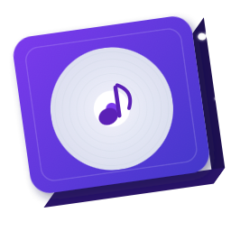

# GroovyBox 🎵

> A modern, cross-platform music player built with [Flet](https://flet.dev/) and Python.

> 🇨🇳 [中文版](README.md)

GroovyBox is a modern music player built with Python and Flet, supporting Windows, macOS, Linux and Android platforms. It features a beautiful Material 3 interface, smart metadata parsing, playlist management, and multilingual support.

<p align="center">
  
</p>

---

## ✨ Features

- 🎶 **Local Music Playback** — Supports multiple audio formats with smooth playback experience
- 📚 **Music Library Management** — Automatically scans and organizes your music collection
- 🎨 **Material 3 Design** — Modern UI with light/dark/follow-system theme modes
- 🎤 **Artist/Album Browsing** — Browse music by artist and album dimensions
- 📋 **Playlists** — Create and manage custom playlists
- 📝 **Lyrics Support** — Built-in lyrics parser with LRC format support
- 🎨 **Adaptive Color** — Automatically extracts theme color from current album cover
- 🌐 **Multilingual** — Supports Chinese/English switching
- 🔍 **Metadata Parsing** — Automatically reads audio file tag information
- 📦 **Cross-Platform** — One codebase, multiple platforms

## 🖥️ Screenshots


## 🚀 Quick Start

### Prerequisites

- Python 3.12+
- pip (Python package manager)

### Installation & Running

```bash
# 1. Clone the repository
git clone https://github.com/liang-work/groovybox.git
cd groovybox

# 2. Install dependencies
pip install -r requirements.txt

# 3. Start the application
python main.py
```

### Using uv (Recommended, Faster)

```bash
# Install uv
pip install uv

# Run
uv run main.py
```

## 📦 Building

The project uses Flet packaging tool for cross-platform building.

```bash
# Install flet
export PATH="$HOME/.local/bin:$PATH"  # Linux/macOS
pip install flet

# Build (output to dist directory)
flet pack main.py --name GroovyBox
```

For detailed build configuration, please refer to `build-config.json` and `build-config-reference.md`.

## 🧩 Project Structure

```
GroovyBox/
├── main.py                    # Application entry point
├── app.py                     # Main application controller (GroovyBoxApp)
├── requirements.txt           # Python dependencies
├── build-config.json          # Build configuration file
├── build-config-reference.md  # Build configuration reference
├── LICENSE                    # GPL-3.0 license
│
├── logic/                     # Logic layer
│   ├── audio_handler.py       # Audio playback handling
│   ├── lyrics_parser.py       # LRC lyrics parsing
│   ├── metadata_service.py    # Audio metadata service
│   ├── playlist_parser.py     # Playlist parsing
│   ├── playlist_exporter.py   # Playlist exporting
│   ├── file_dialog.py         # File dialog
│   ├── file_drop.py           # File drag & drop handling
│   ├── encoding_helper.py     # Encoding helper
│   ├── localize.py            # Multi-language localization
│   ├── logger.py              # Logging system
│   └── zip_importer.py        # ZIP importer
│
├── ui/                        # User interface
│   ├── shell.py               # Main shell (navigation framework)
│   ├── screens/               # Page screens
│   │   ├── library_screen.py         # Music library home
│   │   ├── player_screen.py          # Full-screen player
│   │   ├── artist_detail_screen.py   # Artist detail
│   │   ├── album_detail_screen.py    # Album detail
│   │   ├── albums_by_artist_screen.py# Albums by artist
│   │   ├── playlist_detail_screen.py # Playlist detail
│   │   ├── playlists_screen.py       # Playlist management
│   │   └── settings_screen.py        # Settings page
│   ├── tabs/                  # Tab pages
│   │   ├── albums_tab.py      # Albums tab
│   │   └── playlists_tab.py   # Playlists tab
│   └── widgets/               # Reusable components
│       ├── mini_player.py     # Mini player widget
│       ├── track_tile.py      # Track item component
│       └── universal_image.py # Universal image component
│
├── data/                      # Data layer
│   ├── db.py                  # Database initialization & management
│   ├── models.py              # Data models
│   ├── track_repository.py    # Track data repository
│   └── playlist_repository.py # Playlist data repository
│
├── assets/                    # Resource files
│   ├── images/
│   │   └── icon.jpg           # Application icon
│   └── locales/
│       ├── zh.json            # Chinese translation
│       └── en.json            # English translation
│
└── scripts/                   # Build scripts
    ├── do_build.py            # Automated build script
    └── package_windows.nsi    # Windows installer NSIS script
```

## ⚙️ Configuration

The application will automatically create an SQLite database for storing music library and settings on startup. You can adjust through the settings interface:

- **Language**: Chinese / English
- **Theme Mode**: Light / Dark / Follow System
- **Log Level**: Controls logging verbosity

## 🧪 Tech Stack

| Technology | Purpose |
|------------|----------|
| [Flet](https://flet.dev/) | Cross-platform UI framework |
| [flet-audio](https://github.com/flet-dev/flet-audio) | Audio playback support |
| [mutagen](https://mutagen.readthedocs.io/) | Audio metadata parsing |
| [Pillow](https://python-pillow.org/) | Image processing |
| [colorthief](https://github.com/fengsp/color-thief-py) | Album cover color extraction |
| [httpx](https://www.python-httpx.org/) | HTTP client |
| SQLite | Local data storage |

## 📄 License

This project is open-sourced under the [GNU General Public License v3.0](LICENSE).

## 🚨 Notice

This project is a refactored version of the [Flutter version GroovyBox](https://github.com/Solsynth/GroovyBox). The quality and issues of this project are not related to the original developers NightSystem and [LittleSheep2Code](https://github.com/LittleSheep2Code). This is hereby declared.

Note: The current version cannot be used on mobile devices due to defects in the media playback library.

## 📖 Project History

On August 11, 2025, NightSystem posted a request for help in sn (a community), hoping someone could help complete the initial version of GroovyBox (Swift version) and publish it. Later, LittleSheep2Code expressed willingness to help, and the app became available on TestFlight. However, it was soon abandoned due to the developer being busy. By the end of 2025, LittleSheep2Code recreated the Flutter version of GroovyBox, but it was discontinued again after a short time. A few months later, this project was born.

## 👥 Contributors

- [liang-work](https://github.com/liang-work)
- [ZhiH](https://github.com/ZhiH2333)

---

<p align="center">
  Made by liang-work with ❤️ and Python
</p>
